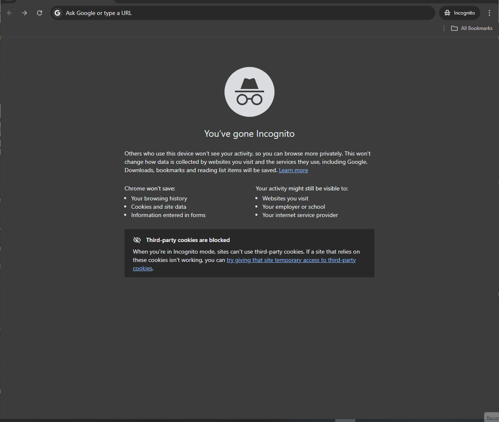

# StreamGrid


StreamGrid is a lightweight, zero-dependency JavaScript data table library written in pure ES6+. It renders HTML tables from any data source, supports built-in text filtering with automatic client/server mode switching, three pagination modes (pages, numbers, infinite scroll), a WordPress-style hook system, and an init-time plugin API — all without a framework.

## Live Demos

[**JS API Demo →**](https://mihai-r-lupu.github.io/streamgrid/docs/index.html) · [**Web Component Demo →**](https://mihai-r-lupu.github.io/streamgrid/docs/web-components.html)



---

## Architecture

See [docs/ARCHITECTURE.md](docs/ARCHITECTURE.md) for design decisions, trade-offs, and the module structure.

For the full plugin and hook system reference — all 17 fire points, priority, namespaces, `once`, commands, and the plugin lifecycle — see [docs/Plugins.md](docs/Plugins.md).

---

## Installation

Clone the repository and install dev dependencies:

```bash
git clone https://github.com/mihai-r-lupu/streamgrid.git
cd streamgrid
npm install
```

Import directly as an ES Module — no bundler required:

```js
import { StreamGrid } from './src/StreamGrid.js';
import { RestApiAdapter } from './src/dataAdapter/RestApiAdapter.js';
```

---

## Minimal Working Example

```js
import { StreamGrid } from './src/StreamGrid.js';
import { RestApiAdapter } from './src/dataAdapter/RestApiAdapter.js';

const grid = new StreamGrid('#my-table', {
    dataAdapter: new RestApiAdapter({ baseUrl: 'http://localhost:3000' }),
    table: 'users',
    columns: ['name', 'email', 'status'],
    filters: ['name', 'email'],
    pagination: true,
    paginationMode: 'numbers',
    pageSize: 20,
});
```

To run a local mock API for development:

```bash
npm run demo   # starts json-server and opens the demo page
```

---

## Web Component

StreamGrid ships as a native Web Component (`<stream-grid>`) for zero-JS HTML-first use. No build step, no framework, no glue code required for the basic case.

### Minimal usage

```html
<script type="module" src="path/to/src/webComponent/stream-grid.js"></script>

<stream-grid
  src="https://jsonplaceholder.typicode.com/users"
  table="users"
  page-size="10">
</stream-grid>
```

### With explicit columns

```html
<stream-grid src="https://api.example.com/products" table="products" page-size="20">
  <stream-grid-column field="name"  label="Product Name"></stream-grid-column>
  <stream-grid-column field="price" label="Price" sortable="false"></stream-grid-column>
  <stream-grid-column field="sku"   label="SKU" width="100px"></stream-grid-column>
</stream-grid>
```

### `<stream-grid>` attribute reference

| Attribute         | Description                                                | Default      |
|-------------------|------------------------------------------------------------|--------------|
| `src`             | Base URL of the REST API. Required unless using JS API.    | —            |
| `table`           | Resource/table name appended to `src`.                     | —            |
| `page-size`       | Rows per page.                                             | `10`         |
| `pagination-mode` | `'pages'` or `'infinite'`.                                 | `'pages'`    |
| `filter-mode`     | `'auto'`, `'client'`, or `'server'`.                       | `'auto'`     |
| `filter-debounce` | Filter input debounce delay in milliseconds.               | `300`        |
| `sort-mode`       | `'auto'`, `'client'`, or `'server'`.                       | `'auto'`     |

### `<stream-grid-column>` attribute reference

| Attribute  | Description                                                                         | Default       |
|------------|-------------------------------------------------------------------------------------|---------------|
| `field`    | Key name in the data object. Required.                                              | —             |
| `label`    | Column header text. Falls back to `field` if absent.                                | field name    |
| `sortable` | Set to `"false"` to disable sorting on this column.                                 | `"true"`      |
| `width`    | CSS width value for the column (e.g. `"120px"`, `"10%"`).                           | auto          |
| `sorter`   | Sort type for this column: `"string"`, `"number"`, `"date"`, or a comparator fn.   | `"string"`    |
| `filter`   | Boolean attribute. When present, this column's field is added to `options.filters`. | absent        |
| `template` | ID of a `<template>` element for declarative cell rendering (see [Declarative Template Rendering](#declarative-template-rendering)). | —  |

### Declarative template rendering

The `template` attribute on `<stream-grid-column>` references a `<template>` element by ID. The template HTML supports `{{value}}` (the cell value) and `{{row.field}}` (any other field in the row). All interpolated values are HTML-escaped automatically.

```html
<template id="status-tpl">
  <span class="badge badge-{{value}}">{{value}}</span>
</template>

<template id="profile-tpl">
  <strong>{{value}}</strong> <small>({{row.department}})</small>
</template>

<stream-grid src="https://api.example.com" table="users" page-size="10">
  <stream-grid-column field="name"   label="Name"   template="profile-tpl"></stream-grid-column>
  <stream-grid-column field="status" label="Status" template="status-tpl"></stream-grid-column>
</stream-grid>
```

If the referenced `<template>` ID is not found, the column renders plain text and a console warning is emitted.

### `element.grid` escape hatch

`document.querySelector('stream-grid').grid` returns the full `StreamGrid` instance for programmatic control — setting render callbacks, registering plugins, subscribing to events:

```js
const el = document.querySelector('stream-grid');
el.grid.on('sortChanged', ({ sortStack }) => console.log(sortStack));
el.grid.columns[0].render = (value) => `<strong>${value}</strong>`;
```

Column children are read once at connection time. To reload with different columns, update the `src` or `table` attributes, or call `element.grid.init()` to hard-refresh.

Setting the `src` attribute after initial render replaces the adapter, clears the data, and re-initialises the grid while preserving sort and filter configuration.

---

## Configuration Options

| Option | Type | Default | Description |
|---|---|---|---|
| `dataAdapter` | `BaseDataAdapter` | — | **Required.** Data source adapter instance. |
| `table` | `string` | — | **Required.** Table/resource name passed to the adapter. |
| `columns` | `string[] \| {field, label, render?}[] \| 'dom'` | `[]` | Column definitions. Each column may include a `render(value, row, context)` callback. Pass `'dom'` to read columns from `<th data-field>` elements already in the container (see [DOM Column Config](#dom-column-config)). Auto-discovered from adapter if omitted. |
| `filters` | `string[]` | `[]` | Fields to enable text filtering on. No filter input if omitted. |
| `plugins` | `object[]` | `[]` | Plugin objects with an optional `init(grid)` method. |
| `customClickHandlers` | `{selector, callback}[]` | `[]` | Delegated click handlers tied to CSS selectors inside the table. |
| `pagination` | `boolean` | `true` | Enable pagination controls. |
| `paginationMode` | `'pages' \| 'numbers' \| 'infinite'` | `'pages'` | Pagination display mode. |
| `pageSize` | `number` | `10` | Rows per page. |
| `paginationFirstLastButtons` | `boolean` | `true` | Show First and Last navigation buttons. |
| `paginationPrevNextText` | `{prev, next}` | `{prev: 'Previous', next: 'Next'}` | Prev/Next button labels. |
| `paginationFirstLastText` | `{first, last}` | `{first: 'First', last: 'Last'}` | First/Last button labels. |
| `paginationOptions` | `object` | `{}` | Advanced options for `numbers` mode (see [Pagination Modes](#pagination-modes)). |
| `scrollContainer` | `string` | container selector | CSS selector for the scroll container used in `infinite` mode. |
| `infiniteScrollTriggerDistance` | `number` | `100` | Pixels from scroll bottom to trigger next batch load. |
| `infiniteScrollPageSize` | `number` | `pageSize` | Rows to append per scroll trigger. |
| `infiniteScrollTotalLimit` | `number` | `undefined` | Hard cap on total rows loaded in infinite mode. |
| `filterDebounceTime` | `number` | `300` | Milliseconds to debounce the filter input. |
| `filterCaseSensitive` | `boolean` | `false` | Enable case-sensitive filtering. |
| `filterMode` | `'auto' \| 'client' \| 'server'` | `'auto'` | Filtering strategy (see [Filter Modes](#filter-modes)). |
| `clientFilterThreshold` | `number` | `1000` | Row count above which `auto` mode switches to server filtering. |
| `loadDefaultCss` | `boolean` | `true` | Auto-inject the bundled `streamgrid.css`. |
| `loadingText` | `string \| Function` | `'Loading…'` | Text shown in the shimmer skeleton while data loads. Pass `() => string \| HTMLElement` for rich content. |
| `emptyText` | `string \| Function` | `'No results'` | Text shown when the filtered result set is empty. Pass `() => string \| HTMLElement` for rich content. |
| `onRenderError` | `Function` | `console.warn` | Called when a column `render()` throws or returns an unexpected type. Receives `(err, { field, value, row })`. |
| `currentPage` | `number` | `1` | Initial page to render. Restored automatically when spreading an `exportConfig()` snapshot. |
| `currentFilterText` | `string` | `''` | Initial filter text. Restored automatically when spreading an `exportConfig()` snapshot. Meaningful only when `filters` is also set. |
| `sortStack` | `{field, direction}[]` | `[]` | Initial sort state. Each entry: `{ field: string, direction: 'asc' \| 'desc' }`. Restored on `exportConfig()` round-trips. |
| `sortMode` | `'auto' \| 'client' \| 'server'` | `'auto'` | Sorting strategy. `'auto'` uses client sort below `clientSortThreshold` rows, server sort above. |
| `clientSortThreshold` | `number` | `clientFilterThreshold` | Row count above which `auto` mode delegates sort to the server. Defaults to `clientFilterThreshold`. |
| `sortNullsFirst` | `boolean` | `false` | When `true`, `null`/`undefined` values sort before non-null values. |

---

## Column Sorting

Columns are sortable by default. Click a header to sort; click again to reverse; click a third time to clear the sort. Hold **Shift** while clicking to build a multi-column sort stack.

```js
const grid = new StreamGrid('#grid', {
    dataAdapter: myAdapter,
    table: 'users',
    columns: [
        { field: 'name',   label: 'Name' },                         // string sort (default)
        { field: 'age',    label: 'Age',    sorter: 'number' },
        { field: 'joined', label: 'Joined', sorter: 'date' },
        { field: 'id',     label: 'ID',     sortable: false },       // not sortable
    ],
    sortStack: [{ field: 'name', direction: 'asc' }],               // initial sort
    sortMode: 'auto',
});
```

### Column definition — sort properties

| Property | Type | Default | Description |
|---|---|---|---|
| `sortable` | `boolean` | `true` | Set `false` to disable sorting on this column. |
| `sorter` | `'string' \| 'number' \| 'date' \| Function` | `'string'` | Built-in type or `(aVal, bVal) => number` comparator. Custom functions never receive `null`/`undefined`. |

### Sort options

| Option | Type | Default | Description |
|---|---|---|---|
| `sortStack` | `{field, direction}[]` | `[]` | Initial sort state. |
| `sortMode` | `'auto' \| 'client' \| 'server'` | `'auto'` | Sorting strategy. |
| `clientSortThreshold` | `number` | `clientFilterThreshold` | Auto-mode threshold. |
| `sortNullsFirst` | `boolean` | `false` | Sort nulls before non-null values. |

### Click interaction

| Click | Behaviour |
|---|---|
| Plain click (unsorted column) | Replace stack with `[{field, asc}]` |
| Plain click (asc column) | Replace stack with `[{field, desc}]` |
| Plain click (desc column) | Clear stack |
| Shift+click (unsorted column) | Push `{field, asc}` to end of stack |
| Shift+click (asc column) | Toggle to `desc` (preserves stack order) |
| Shift+click (desc column) | Remove from stack (preserves other entries) |

### `sortMode` × `filterMode` combinations

| sortMode | filterMode | Behaviour |
|---|---|---|
| `client` | `client` | All in memory — no extra requests |
| `client` | `server` | Server filters, client sorts |
| `server` | `client` | Client filters, server sorts |
| `server` | `server` | Server handles both |
| `auto` | `auto` | Each stage resolves independently based on its threshold |

---

## Column Render Callbacks

Each column definition can include a `render(value, row, context)` callback for full control over cell content.

```js
import { html } from 'stream-grid/utils';

const grid = new StreamGrid('#grid', {
    dataAdapter: myAdapter,
    table: 'users',
    columns: [
        { field: 'name', label: 'Name' },
        {
            field: 'status',
            label: 'Status',
            render: (value) => html`<span class="badge badge--${value}">${value}</span>`,
        },
        {
            field: 'actions',
            label: '',
            render: (value, row) => {
                const btn = document.createElement('button');
                btn.textContent = 'Delete';
                btn.addEventListener('click', () => deleteRow(row.id));
                return btn;
            },
        },
    ],
});
```

### What `render()` can return

| Return type | Behaviour |
|---|---|
| `string` | Set as `td.innerHTML` — allows safe HTML markup. Use the `html` tag to auto-escape interpolated values. |
| `Node` | Appended directly via `td.appendChild()`. |
| `null` / `undefined` | Falls back to the raw `textContent` value of the field. |
| Anything else | `onRenderError` is called; the cell falls back to `textContent`. |
| Thrown exception | `onRenderError` is called; the cell is left empty. |

### `context` argument

The third argument passed to `render()` is `{ type: 'display', field, col }` where `col` is the original column definition object. `type` is always `'display'` today; additional context types may be introduced in future releases. Callbacks that ignore `context` entirely will continue to work without modification.

### XSS-safe templating with `html`

The `html` tagged template literal escapes all interpolated values, making it easy to build markup without introducing XSS vulnerabilities:

```js
import { html } from 'stream-grid/utils';

render: (value) => html`<strong class="status">${value}</strong>`
```

### Custom error handling

```js
const grid = new StreamGrid('#grid', {
    // ...
    onRenderError: (err, { field, value, row }) => {
        myErrorTracker.capture(err, { field, value });
    },
});
```

---

## DOM Column Config

Inspired by DataTables, StreamGrid can read column definitions directly from `<th>` elements already present in the container. Pass `columns: 'dom'` and annotate your header cells with `data-*` attributes:

```html
<div id="grid">
  <table>
    <thead>
      <tr>
        <th data-field="name"  data-sg-label="Full Name" data-sg-filter>Name</th>
        <th data-field="age"   data-sg-sorter="number">Age</th>
        <th data-field="email" data-sg-sortable="false" data-sg-filter>Email</th>
        <th data-field="sku"   data-sg-width="100px">SKU</th>
      </tr>
    </thead>
  </table>
</div>
```

```js
const grid = new StreamGrid('#grid', {
    dataAdapter: myAdapter,
    table: 'users',
    columns: 'dom',
});
```

### `data-*` attribute reference

| Attribute          | Description                                                              | Default              |
|--------------------|--------------------------------------------------------------------------|----------------------|
| `data-field`       | Key name in the data object. **Required** — grid throws if missing.      | —                    |
| `data-sg-label`    | Column header text. Falls back to `th.textContent`, then `data-field`.   | `th.textContent`     |
| `data-sg-sortable` | Set to `"false"` to disable sorting on this column.                      | `true`               |
| `data-sg-sorter`   | Sort type: `"string"`, `"number"`, or `"date"`.                          | `"string"`           |
| `data-sg-filter`   | Boolean attribute. When present, adds this field to `grid.filters`.      | absent (no filter)   |
| `data-sg-width`    | CSS width value (e.g. `"120px"`, `"10%"`).                               | auto                 |

> **Note:** if no `<thead>` or no `<th>` elements are found, StreamGrid emits a console warning and falls back to adapter column auto-discovery.

---

## Public Methods

| Method | Returns | Description |
|---|---|---|
| `init()` | `Promise<void>` | Loads columns and data, initialises plugins, then renders. Called automatically in the constructor; call again to hard-refresh. Emits `loading` then shows shimmer rows before any network requests. |
| `showLoading()` | `void` | Renders shimmer skeleton rows immediately. Called automatically by `init()`; can be called externally before a manual data refresh. |
| `showEmpty()` | `void` | Replaces the table body with the empty-state row. Called automatically when data loads with zero rows; can also be called externally. |
| `goToPage(pageNum)` | `void` | Navigates to a 1-based page number and re-renders. |
| `loadMoreRows()` | `void` | Appends the next batch in infinite-scroll mode. |
| `getFilteredRows()` | `object[]` | Returns the current filtered row set from the in-memory DataSet. |
| `exportConfig()` | `object` | Returns a plain serialisable snapshot of all config and live state. See [Saving and Restoring Grid State](docs/GettingStarted.md#saving-and-restoring-grid-state). |
| `on(event, fn)` | `void` | Subscribe to a lifecycle event. |
| `off(event, fn)` | `void` | Unsubscribe from a lifecycle event. |
| `addAction(name, fn)` | `void` | Register a hook action. |
| `addFilter(name, fn)` | `void` | Register a hook filter. |
| `doAction(name, data)` | `void` | Fire a hook action. |
| `applyFilters(name, value)` | `any` | Apply all registered hook filters to a value. |
| `doActionAsync(name, ...args)` | `Promise<void>` | Fire a hook action and await all async callbacks. |
| `applyFiltersAsync(name, value, ...args)` | `Promise<any>` | Apply all registered hook filters asynchronously and return the result. |
| `removeAction(name, fn)` | `void` | Unregister a specific hook action callback. |
| `removeFilter(name, fn)` | `void` | Unregister a specific hook filter callback. |
| `hasAction(name)` | `boolean` | Returns `true` if any action callbacks are registered under `name`. |
| `hasFilter(name)` | `boolean` | Returns `true` if any filter callbacks are registered under `name`. |
| `removeAllHooks(namespace)` | `void` | Remove all hooks registered under a given namespace. |
| `registerCommand(name, handler)` | `void` | Register a named command handler. |
| `executeCommand(name, ...args)` | `any` | Execute a registered command by name. |
| `importConfig(snapshot)` | `Promise<void>` | Restores runtime mutable state (page, filter text, sort stack) from a snapshot and re-initialises the grid. Does not overwrite construction-time config. |
| `onDestroy(callback)` | `void` | Register a callback to run when the grid is destroyed. |
| `destroy()` | `void` | Tear down the grid: removes event listeners, DOM, and fires `beforeDestroy` hooks. |

---

## Pagination Modes

### `pages` — Classic Prev/Next

```js
paginationMode: 'pages',
pageSize: 20,
paginationFirstLastButtons: true,
paginationPrevNextText: { prev: '← Prev', next: 'Next →' },
paginationFirstLastText: { first: '« First', last: 'Last »' },
```

Renders First / Previous / Next / Last buttons only.

### `numbers` — Sliding window page numbers

```js
paginationMode: 'numbers',
pageSize: 20,
paginationOptions: {
    maxPageButtons: 7,     // visible page number count
    showEllipses: true,    // render '…' when pages are hidden
    jumpOffset: 10,        // render «10 / 10» jump buttons
    groupSize: 50,         // render a group-select dropdown
    showPageInput: true,   // render a go-to-page input
},
```

Renders First / Prev + numbered page buttons + Next / Last. All `paginationOptions` are optional.

### `infinite` — Scroll-triggered loading

```js
paginationMode: 'infinite',
infiniteScrollPageSize: 50,
infiniteScrollTriggerDistance: 150,
infiniteScrollTotalLimit: 500,   // optional cap
```

No pagination controls are rendered. More rows are appended automatically when the user scrolls within `infiniteScrollTriggerDistance` pixels of the container bottom.

---

## Auto-Switching Client/Server Filtering

When the loaded row count is at or below `clientFilterThreshold`, filtering runs in memory. Above it, the grid sends the filter query to the server through the adapter.

| Mode | Behaviour |
|---|---|
| `'client'` | Always filter in-memory. No extra server requests. |
| `'server'` | Always send the filter query to the server as URL parameters (`q`, `fields`). |
| `'auto'` *(default)* | Uses client filtering when the loaded row count is ≤ `clientFilterThreshold`; switches to server filtering above it. |

```js
filterMode: 'auto',
clientFilterThreshold: 1000,
filters: ['name', 'email'],
filterDebounceTime: 300,
```

---

## Events

Subscribe to lifecycle events with `grid.on(eventName, callback)`.

| Event | Payload | When |
|---|---|---|
| `loading` | — | At the start of `init()`, before any network requests. Useful for disabling external buttons or showing a progress indicator. |
| `dataLoaded` | `row[]` | After data is fetched from the adapter. |
| `tableRendered` | `gridInstance` | After the table body is re-rendered. |
| `filterApplied` | `{filterText, totalFilteredRows}` | After a filter operation completes. |
| `paginationChanged` | `{currentPage, totalRows}` | When the user navigates to a different page. |
| `sortChanged` | `{sortStack: [{field, direction}]}` | After the sort stack changes (header click). Payload contains a deep copy of the new stack. |
| `dataRowClicked` | `rowData` | When a `<tbody>` row is clicked. |
| `cellClicked` | `{rowData, columnField}` | When a `<td>` is clicked. |
| `headerClicked` | `{columnField}` | When a `<th>` is clicked. |
| `headerRowClicked` | — | When the `<thead>` row is clicked. |
| `tableClicked` | `MouseEvent` | When anything inside the table is clicked. |

> **Note:** `cellClicked`, `dataRowClicked`, and related events are not emitted for shimmer or empty-state rows — only for actual data rows.

```js
grid.on('dataRowClicked', row => console.log('Row clicked:', row));
grid.on('filterApplied', ({ filterText, totalFilteredRows }) => {
    console.log(`Showing ${totalFilteredRows} results for "${filterText}"`);
});
```

---

## Hooks

The hook system follows the WordPress `addAction` / `addFilter` pattern. Multiple callbacks stack in registration order.

**Action hooks** — fire-and-forget side effects:

```js
grid.addAction('myAction', (data) => {
    console.log('Action fired with:', data);
});
grid.doAction('myAction', { foo: 'bar' });
```

**Filter hooks** — chainable value transformation:

```js
grid.addFilter('myFilter', (value) => value.toUpperCase());
grid.addFilter('myFilter', (value) => `[${value}]`);

const result = grid.applyFilters('myFilter', 'hello');
// result === '[HELLO]'
```

**Async hooks** — when callbacks need to `await` async work:

```js
grid.addFilter('beforeDataLoad', async ({ incoming, current }) => {
    const enriched = await fetchMetadata(incoming);
    return { incoming: enriched, current };
});

const result = await grid.applyFiltersAsync('beforeDataLoad', { incoming, current });
```

For the full hook API — priority ordering, namespaces, `once` callbacks, all 17 built-in fire points, `getState`/`setState` for plugin state persistence, the command registry, and debug mode — see [docs/Plugins.md](docs/Plugins.md).

---

## Plugins

A plugin is any object with an optional `init(grid)` method. It receives the full grid instance and can attach DOM controls, subscribe to events, call any public method, or register hooks.

```js
class WordCountPlugin {
    init(grid) {
        const label = document.createElement('div');
        grid.on('filterApplied', ({ totalFilteredRows }) => {
            label.textContent = `${totalFilteredRows} rows`;
        });
        grid.container.parentElement.insertBefore(label, grid.container);
    }
}

const grid = new StreamGrid('#my-table', {
    // ...
    plugins: [new WordCountPlugin()],
});
```

Plugins are initialised after data is loaded, so `grid.dataSet` is populated when `init()` runs.

---

## Custom Adapters

The adapter contract is duck-typed: any object that implements the five methods (`getColumns`, `fetchData`, `insertRow`, `updateRow`, `deleteRow`) is a valid adapter. Extending `BaseDataAdapter` is optional — it provides convenience stubs and self-documenting errors, but is not required.

```js
import { BaseDataAdapter } from './src/dataAdapter/BaseDataAdapter.js';

export class MyAdapter extends BaseDataAdapter {
    async getColumns(table) {
        // Return ['col1', 'col2', ...]
    }
    async fetchData(table, options = {}) {
        // Return [{ col1: 'val', col2: 'val', ... }, ...]
    }
    async insertRow(table, data) { /* ... */ }
    async updateRow(table, id, data) { /* ... */ }
    async deleteRow(table, id) { /* ... */ }
}
```

For REST APIs, the built-in `RestApiAdapter` serialises filter, pagination, and sort state into standard URL query parameters:

```js
import { RestApiAdapter } from './src/dataAdapter/RestApiAdapter.js';

const adapter = new RestApiAdapter({ baseUrl: 'https://api.example.com' });
```

`RestApiAdapter` automatically fetches one row (`?_limit=1`) and infers column names from its keys. No dedicated `/columns` endpoint is required.

To add transparent caching to any adapter, wrap it with `CacheAdapter`:

```js
import { CacheAdapter } from './src/dataAdapter/CacheAdapter.js';

const adapter = new CacheAdapter(
    new RestApiAdapter({ baseUrl: 'https://api.example.com' }),
    { ttl: 30000 }
);
```

See [docs/Adapters.md](docs/Adapters.md) for full `CacheAdapter` options.

---

## Testing

StreamGrid has **304 tests** — 253 unit tests and 51 end-to-end tests.

**Unit tests** (Mocha + Chai, JSDOM — no browser required):

```bash
npm run test:unit      # 253 tests
```

**End-to-end tests** (Playwright — server starts automatically):

```bash
npm run test:e2e       # 51 tests across Chromium, Firefox, and WebKit
```

The E2E suite uses Page Object Model with custom Playwright fixtures and includes:

- **Accessibility** — automated WCAG audits via axe-core on every grid variant
- **Visual regression** — pixel-diff baseline screenshots that catch CSS regressions
- **API-layer validation** — Playwright `request` context tests against the REST endpoint
- **Network resilience** — route interception tests for empty data, slow responses, and 500 errors
- **Performance budgets** — render time and DOM node count assertions
- **Test tags** — run `npx playwright test --grep "@smoke"` for a 9-test critical-path subset (~14s)

Playwright auto-starts json-server via the `webServer` config. To keep the server running for manual testing as well:

```bash
npm run serve:test     # terminal 1: start json-server on port 3000
npm run test:e2e       # terminal 2: run Playwright tests
```

**Run both:**

```bash
npm test
```

---

## License

MIT — see [LICENSE](LICENSE).
